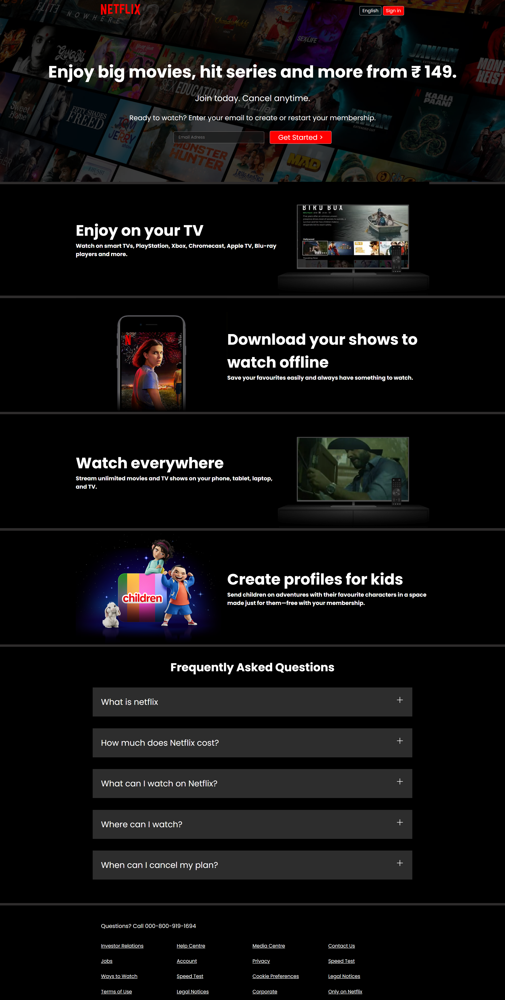

# Netflix-UI-UX-Clone
I built a Netflix UI/UX clone using HTML and CSS to sharpen my design skills. Through this project, I was able to fully appreciate the power of HTML and CSS in crafting visually appealing and responsive front-end interfaces. This project highlights how simple technologies can be leveraged to create sleek and professional web designs.

